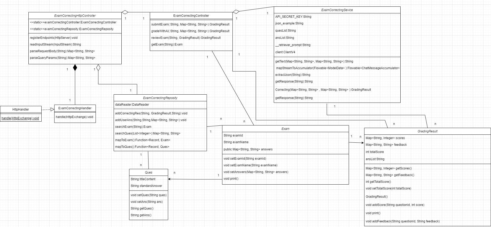
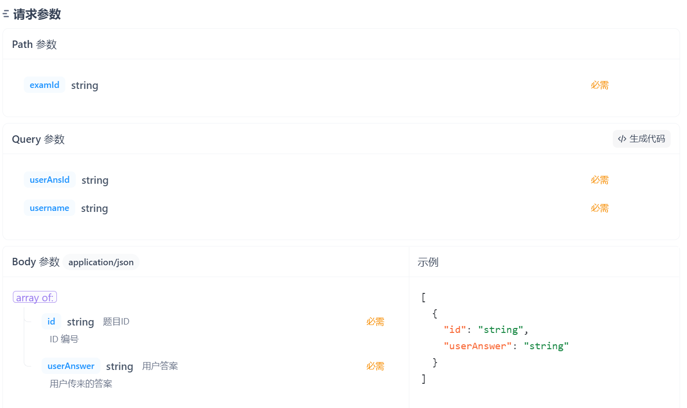
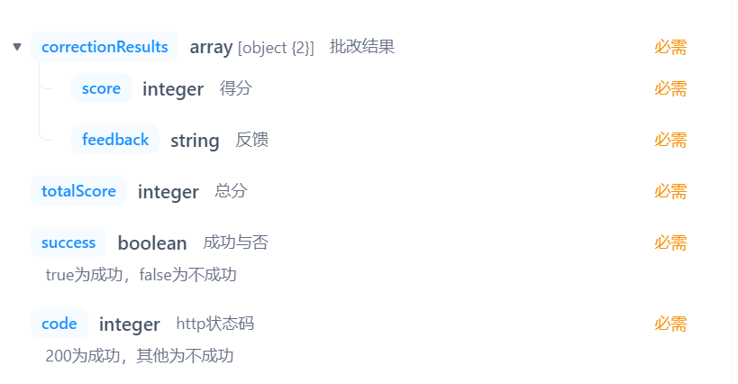
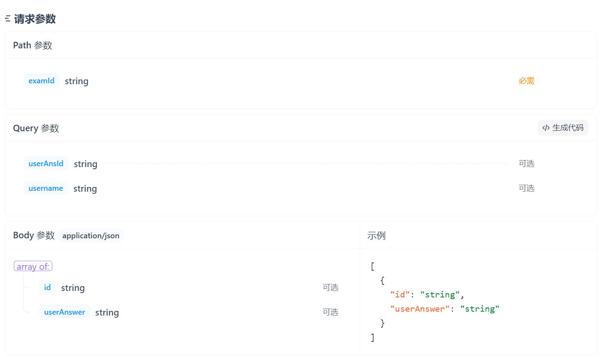
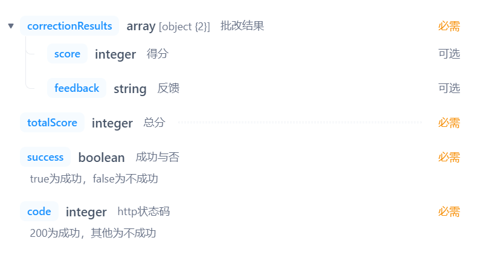
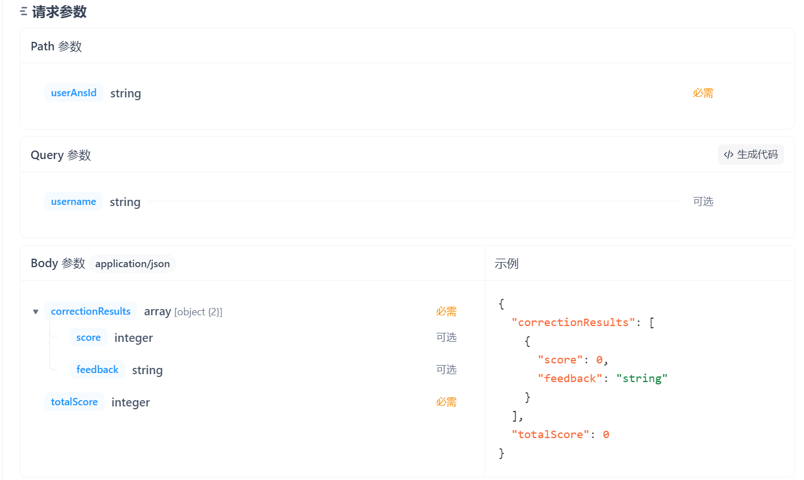
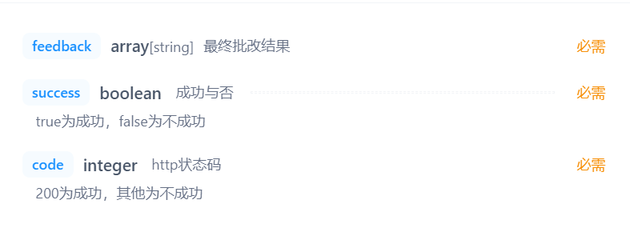

## 一、过程分析
### 1. 过程度量与指标
#### 进度指标：
项目进度是软件开发的关键因素之一。我们采用里程碑达成情况来评估项目是否按时推进。标记了关键任务或阶段的完成情况。项目中涉及“大模型批改试卷接口实现”这一里程碑，它标志着大模型接口和后端系统的有效集成。通过此里程碑，团队能够确认接口是否稳定、功能是否完善，并为后续的批改结果展示和反馈功能的开发提供基础支持。

- 工程框架搭建完成：
任务：完成数据转换和结构化数据设计，实现初步的系统框架。
验收标准：完成“Exam”类、“GradingResult”类和“Ques”类的设计，确保数据结构能支持后续的批改与反馈功能。

- 大模型接口搭建完成：
任务：成功集成大模型API，能够进行试卷的自动批改。
验收标准：后端可以通过调用大模型API进行试卷批改，并返回得分与反馈。

- 试卷提交批改功能实现：
任务：实现学生提交试卷并获取批改结果的后端接口。
验收标准：能够接收学生提交的答案，调用批改接口，返回批改结果。

- 试卷复核功能实现：
任务：实现教师对试卷批改结果的复核和修改功能。
验收标准：教师能够修改批改结果，并提供相应的反馈。

- 用户与批改结果关联功能实现：
任务：将学生提交的试卷与批改结果进行关联。
验收标准：系统能够通过用户ID和答案ID正确关联学生提交的试卷和批改结果。

#### 生产力指标：
为了评估团队的工作效率，我们通过每个迭代的完成故事点数、代码提交频率等生产力指标来衡量项目进度。这些指标能够反映团队在特定时间内的生产能力，以及是否能够按期完成开发任务。在每个迭代（1周）结束时，我们的团队会评估完成了多少故事点数。具体实现为每节课前或单独找时间确认成员的工作完成情况。

#### 质量指标：
质量是软件开发中的重中之重。我们通过代码审查次数和自动化测试覆盖率等质量指标来保证系统的质量。代码审查有助于发现潜在的缺陷，并确保代码符合团队的编码规范，针对每个关键功能模块，团队成员会进行代码审查，特别是在涉及到与外部大模型接口交互的模块时，确保数据传输的准确性和安全性。通过持续的代码审查，团队能够及早发现并修复代码缺陷，减少后期的调试和维护成本，提升软件的稳定性和可靠性。而自动化测试则能够在不同开发阶段提供持续的质量保证。在该项目中，自动化测试尤其重要，因为系统涉及多个功能模块，包括试卷提交、批改、复核等，且需要与外部大模型接口进行交互。通过自动化测试，团队能够在每次提交代码后迅速检测到功能是否按预期工作，并且能够发现接口调用过程中可能出现的问题。

### 2. 项目管理
#### 计划与跟踪：
我们通过每周例会和线上交流来保持团队成员之间的沟通与协调。在每次会议中，我们审视项目的进度，讨论遇到的问题，并根据实际情况调整任务的优先级或资源的分配，以确保项目能够按期推进。通过这种方式，我们能够灵活应对项目中的变化，及时调整开发计划，保证项目按预定目标进行。

#### 风险管理：
我们通过定期的风险评审，识别可能影响项目进度、质量或预算的因素，并制定应对措施，如时间缓冲、资源调整等。

#### 沟通与协作：
通过定期的团队会议和项目报告，确保团队成员之间的信息流畅传递。

### 3. 模块的建模
试卷批改类图

在整个系统的设计过程中，我们采用面向对象的方法对系统的各个功能模块进行建模，确保系统的高效性、可扩展性和可靠性。主要模块包括：试卷提交、试卷批改、大模型接口、大模型批改、试卷复核以及用户关联等。每个模块都通过明确的类与接口进行设计，并通过数据模型确保其功能的清晰划分与可扩展性。以下是每个模块的详细设计和工作流程：

#### 模块设计
- 工程框架搭建（转换结构化数据）
在项目初期，我们首先搭建了工程框架，重点工作是将非结构化的数据转化为可管理的结构化数据格式。具体来说，试卷、学生答案、批改结果等信息从不同的来源转化为符合系统要求的结构化数据，并确保数据能够存储和高效检索。数据的存储采用了Neo4j图形数据库，能够有效支持复杂的数据关联和查询操作。

- 大模型接口搭建（知识点节点关系生成、试卷批改）
为了支持试卷批改功能，我们构建了与大模型（如智谱AI）交互的接口。学生提交试卷答案后，系统通过后端调用大模型接口对答案进行批改，返回每道题的得分和智能反馈。接口的核心功能是对试卷中的每个题目进行自动批改，并生成与知识点相关的反馈。此模块的核心功能是通过RESTful API与大模型进行交互，处理学生提交的试卷并返回批改结果。

- 试卷提交批改后端实现
该模块负责处理学生提交的试卷答案，并进行批改。学生通过前端提交答案，后端接收并存储答案，同时调用大模型接口进行批改。批改结果包含每道题的得分和反馈，并会存储在数据库中。在此过程中，submitExam方法负责接收答案，并调用gradeWithAI方法与大模型交互。

- 大模型批改试卷后端实现
此模块的核心是与大模型进行交互，利用其强大的智能批改功能。通过调用大模型的批改接口，后端将学生提交的答案与标准答案进行比对，返回批改结果。这一过程不仅生成每道题的得分，还包括针对错误的详细反馈。接口路径为/api/exam/{examId}/grade，后端通过gradeWithAI方法将试卷和答案提交给大模型，并处理返回的结果。

- 试卷复核功能后端实现
教师可以对已批改的试卷进行复核，修改批改结果或提供额外的反馈。复核功能通过/api/exam/{userAnsId}/review接口实现，允许教师在后台进行修改。复核后，系统将更新批改结果并反馈给学生。教师可以根据自己的判断对得分和反馈进行修改，从而提高批改的准确性。

- 试卷提交批改关联用户
每次学生提交试卷时，系统需要确保提交的试卷与学生账号进行关联，以便学生后续查看批改结果。系统通过addUserAns方法将学生的答案与用户数据进行关联，确保每个学生的提交都能正确地与其账户绑定。同时，批改结果也会通过addCorrectingRes方法与学生的作答和试卷信息进行关联，确保批改结果能被准确存储和查询。

#### 数据设计
1. Exam 类设计
Exam 类表示一份试卷，包含试卷的基本信息以及该试卷的所有题目和答案。这个类为后端提供了清晰的接口，便于展示、修改和更新试卷内容。

   - 数据字段：
    examId: 试卷的唯一标识符
    examName: 试卷名称
    answers: 存储题目与标准答案的映射关系，使用 Map<String, String> 类型
   - 核心方法：
    setExamId(String examId): 设置试卷的ID
    setExamName(String examName): 设置试卷名称
    setAnswers(Map<String, String> answers): 设置标准答案列表
    getExample(): 生成试卷示例
    print(): 打印试卷信息，包括题目和答案

2. GradingResult 类设计
GradingResult 类用于存储批改结果，包括得分和反馈。

   - 数据字段：
   scores: 存储每道题目得分的映射
   feedback: 存储每道题目的批改反馈
   totalScore: 总得分
   - 核心方法：
   addScore(String questionId, int score): 为指定题目添加得分
   addFeedback(String questionId, String feedback): 为指定题目添加反馈
   getScores(): 获取所有题目的得分
   getFeedback(): 获取所有题目的反馈
   getTotalScore(): 获取试卷总分
   print(): 打印批改结果，包括每道题的得分和反馈

3. Ques 类设计
    Ques 类表示一个单独的题目，包含题目内容和标准答案。
    - 数据字段：
    titleContent: 题目内容
    standardAnswer: 标准答案
    - 核心方法：
    setQues(String ques): 设置题目内容
    setAns(String ans): 设置标准答案
    getQues(): 获取题目内容
    getAns(): 获取标准答案
#### 系统工作流程
- 试卷提交与批改：
学生提交试卷答案，后端接收并存储。
后端调用大模型接口进行自动批改。
返回批改结果给学生，包括得分和详细反馈。

- 试卷复核：
教师对批改结果进行复核，必要时修改得分和反馈。
更新后的结果反馈给学生。

#### 接口设计
- 试卷提交批改接口：
请求方法：POST
请求路径：/api/exam/{examId}/submit
功能描述：提交学生的试卷答案，系统批改后返回得分和反馈。
接口请求参数

接口响应参数

- 大模型批改试卷接口：
请求方法：POST
请求路径：/api/exam/{examId}/grade
功能描述：通过大模型对试卷进行批改，返回得分和智能反馈。
接口请求参数

接口响应参数

- 试卷复核接口：
请求方法：GET
请求路径：/api/exam/{userAnsId}/review
功能描述：教师对试卷进行复核，修改批改结果并提供反馈。
接口请求参数

接口响应参数

#### 功能实现：
1. 工程框架搭建（转换结构化数据）
此模块主要负责将非结构化数据转化为系统能高效存储和处理的结构化数据格式。具体实现方式如下：
- 数据转换：将数据库中的试卷等转换为程序中的数据结构，将批改结果等数据从原始的文件或其他形式转换为符合数据库模型的格式。
- 数据存储：使用Neo4j存储转化后的结构化数据。确保数据的完整性与一致性。
2. 大模型接口搭建（试卷批改）
该模块通过与大模型接口的集成，实现试卷批改的功能：
当学生提交试卷答案后，后端调用大模型批改接口，进行自动批改，并返回详细的批改结果，包括每道题目的得分、反馈意见等。
- 关键接口：
/api/exam/{examId}/submit 提交试卷答案并批改
通过此接口，学生提交答案后，后端会调用大模型接口批改试卷。
/api/exam/{examId}/grade 调用大模型批改试卷。
该接口通过后端调用大模型API，对学生提交的答案进行自动批改。
/api/exam/{userAnsId}/review 教师对试卷进行二次批改或复核
教师通过该接口对已批改的试卷进行二次复核
3. 试卷提交批改后端实现
此功能模块处理学生提交试卷的答案，并通过调用大模型接口进行批改：
- 接收答案：学生提交试卷后，后端接收学生提交的答案，存入数据库中。
- 调用大模型批改：后端调用大模型API进行批改，根据学生的答案和试题内容生成批改结果，包括每道题的得分、答错的原因等。
- 返回结果：系统将批改结果返回给学生，并提供详细反馈，以帮助学生了解自己的不足。
在系统中，用户通过前端提交试卷答案，后端通过submitExam方法进行处理，该方法调用gradeWithAI进行自动批改，并返回批改结果。具体流程如下：
submitExam方法：接收用户提交的试卷ID和答案（examId 和 answers），调用gradeWithAI方法进行批改，并返回批改结果（GradingResult）。
gradeWithAI方法：从数据库中获取试卷信息，并将问题列表和学生的答案传递给ExamCorrectingSevice.Correcting方法，获取AI批改结果。
4. 大模型批改试卷后端实现
大模型批改的核心实现：
- 调用大模型：当学生提交答案时，后端将学生的答案通过接口发送给大模型进行批改。
- 批改结果：大模型将返回每道题的得分和反馈，后端将这些结果处理并存储在数据库中。
- 结果展示：批改完成后，系统将批改结果返回给前端，学生可以查看每道题的得分及教师的反馈。
- 与大模型批改接口交互：
gradeWithAI方法：调用了ExamCorrectingSevice.Correcting方法，实际上就是将试卷内容、学生的答案传递给外部大模型进行批改。大模型会返回一个批改结果，包括得分和反馈。
该方法通过解析AI返回的结果，返回一个GradingResult对象，包含所有试题的得分和反馈。
5. 试卷复核功能后端实现
教师可以对学生的试卷进行复核，以便进行二次批改或提供进一步的反馈：
- 复核接口：教师通过复核接口对学生试卷进行人工批改，修改自动批改结果，提供额外反馈。
- 返回复核结果：系统在复核完成后，将最终批改结果返回给学生。
- reviewExam方法：该方法允许教师在复核过程中修改自动批改结果。教师根据自己的判断修改反馈信息，并保存最终的批改结果。
6. 试卷提交批改关联用户
系统需要确保每次试卷批改都与提交的学生账号进行关联：
- 关联学生：每次提交的试卷及其批改结果都会与学生的账户进行关联，确保学生可以查看自己的批改结果。
- 用户数据管理：通过数据库中的用户ID字段，确保每个学生提交的答案和批改结果都能正确关联。
7. 试卷内容获取
在系统中，ExamCorrectingReposity类负责从Neo4j数据库中获取试卷内容，提交用户答案，并将批改结果与用户和试卷进行关联。以下是关键功能的详细实现。
- searchExam方法：该方法根据examId从Neo4j数据库中查询试卷的详细信息，包括试卷ID、名称及题目列表。返回的是一个Exam对象，包含试卷的基本信息和题目答案。
- searchQues方法：该方法根据题目ID列表（num）从Neo4j数据库中查询每道题目的描述和标准答案，返回一个Map<String, String>，其中key为题目描述，value为标准答案。
8. 用户作答提交
addUserAns方法：该方法用于将用户的作答提交到Neo4j数据库。它根据试卷ID（examId）和用户作答信息（answers），创建一个新的用户作答节点，并将其与试卷节点关联。
9. 试卷批改结果提交
addCorrectingRes方法：该方法用于将批改结果提交到Neo4j数据库。它通过用户答案ID（userAnsId）和批改结果（GradingResult），将批改结果节点与用户作答节点和用户信息节点关联。
10. 批改结果与用户和试卷的关联
该功能实现了批改结果与试卷、用户之间的关联，便于后续查询和复核。每当批改完成后，addCorrectingRes方法会将批改结果存储到Neo4j数据库，并通过correctRes关系将批改结果与用户作答、用户信息、试卷等节点关联。
操作流程：
- 获取用户作答（userAnsId）和批改结果（GradingResult）。
- 通过userAnsId和userName获取用户和作答信息。
- 根据批改结果（scores、feedback）创建批改结果节点，并与用户作答节点（UserAns）及用户信息节点（用户信息）关联。
11. 数据映射方法
在ExamCorrectingReposity类中，使用了多个数据映射方法将从Neo4j数据库查询到的结果映射为相应的Java对象。关键的映射方法如下：
- mapToExam方法：将Neo4j查询结果映射为Exam对象，包含试卷ID、名称和问题列表。- mapToQues方法：将查询结果映射为Ques对象，包含题目描述和标准答案。

#### 系统架构与组件
- 前后端分离架构：
前端通过Vue框架与用户交互，后端处理逻辑并提供RESTful API。
- Neo4j数据库：
存储试卷、题目、批改结果、知识点和用户信息等。
- 大模型接口：
系统通过调用大模型接口实现自动批改功能。

### 4. 质量保证（QA）过程
#### 测试策略：
为了确保系统的可靠性、稳定性以及用户满意度，我们实施了全面的多层次测试策略，涵盖了单元测试、模块测试、前后端联调测试、系统测试以及交付测试。以下是基于项目需求的具体测试内容和执行策略：

##### 1.单元测试（基础逻辑、函数等）
单元测试是对代码中最小功能单元（如函数和方法）进行测试，确保各个功能模块的基本逻辑正确性。

测试内容：

数据模型测试：测试Exam、GradingResult、Ques等类中的方法是否按照预期正确工作。

例如：

Exam类的setExamId、setExamName等方法是否能成功设置试卷信息。
GradingResult的addScore和addFeedback方法是否能正确记录批改结果。
Ques类的setQues和setAns是否能正确设置题目和答案。

##### 2.模块测试（每个接口、页面）
模块测试验证每个独立模块、功能或接口是否按照预期工作，确保不同部分的业务逻辑实现无误。

测试内容：

试卷提交与批改接口：测试/api/exam/{examId}/submit接口是否能够成功接收试卷数据，并且能正确调用批改服务。
大模型批改接口：验证/api/exam/{examId}/grade接口是否能正确调用大模型接口进行试卷批改，并返回得分和反馈。
试卷复核接口：验证/api/exam/{userAnsId}/review接口是否能正确执行教师复核操作，并更新批改结果。

##### 3.前后端联调测试（每个页面和对应的接口）
前后端联调测试确保前端页面能够正确地调用后端接口，前后端的数据交互能够顺利进行，UI呈现数据正确。

测试内容：

试卷提交页面：用户提交试卷后，前端应正确展示试卷提交表单，并在用户提交后触发相应的API接口，后端返回的结果应正确显示在页面上。
试卷批改结果页面：当学生提交试卷后，前端应展示批改结果，包括得分、错误题目和反馈信息。
示例测试：

提交试卷页面测试：
模拟用户在页面填写答案并提交，前端通过API调用提交接口。
确认后端返回批改结果，并且在页面上展示正确的反馈。

##### 4.系统测试（整个软件）
系统测试是对整个系统进行的全面测试，确保所有功能模块在实际环境下能够协调工作。测试的重点是系统的功能实现、性能、兼容性和安全性。

测试内容：

功能完整性：模拟不同场景下的用户操作，确保系统功能都能正常工作，如试卷提交、批改、复核等。
性能测试：检查系统在高并发情况下的响应速度和稳定性。

#### 缺陷管理：
在本项目中，缺陷管理采用了严格的流程，以确保系统的质量和稳定性。我们整个团队高效地报告、跟踪、修复和验证缺陷。

1. 缺陷报告：在测试过程中，任何发现的缺陷都会立即通过QQ群进行报告。报告内容包括缺陷的详细描述、复现步骤、期望结果与实际结果的对比以及相关截图或日志。每个缺陷都会分配给相关开发人员进行处理，并且明确优先级。

2. 缺陷跟踪：所有缺陷都会进行记录，并持续跟踪。确保所有问题都得到及时解决。每个缺陷都会设置修复的时间线，并与相关的任务进行关联，以便于后续跟进。

3. 缺陷修复：根据报告的缺陷描述进行代码修复，修复后会进行单元测试和模块测试，确保修复后的功能没有引入新的问题。

4. 缺陷验证：一旦缺陷修复完成，重新验证已修复的问题。通过回归测试，确保修复的缺陷没有影响到其他模块的功能。

### 5. 过程改进
#### 持续改进：
我们通过回顾会议，总结过去一段时间的开发经验，识别潜在的改进点，并在后续的开发中加以实施。确保团队不断提高工作效率和质量。

#### 过程成熟度模型：
在本项目中，我们采用CMMI（能力成熟度模型集成）来评估和提升团队的过程成熟度。CMMI是一种全面的过程改进模型，旨在帮助团队优化开发流程、提高工作效率、降低风险，从而确保项目的成功交付和长期可持续性。通过实施CMMI模型，我们可以对团队的工作流程进行定期评估和改进，确保开发过程中各个环节的质量和可控性。

1. 初始级：在项目初期，我们主要依赖团队成员的个人经验和技术水平进行开发，项目管理和过程控制尚未形成系统化的标准和规范。此阶段的重点是确保开发任务的按时完成，同时积累实践经验。

2. 已管理级：随着项目进展，团队逐步建立了基本的项目管理流程，包括需求分析、进度管理、质量控制等，并开始应用一些基本的项目管理工具。此阶段，我们重点关注过程的可重复性和可度量性，确保项目按计划推进。

3. 已定义级：在此阶段，我们逐步制定并实施标准化的开发过程，包括需求管理、设计规范、编码规范、测试标准等。团队开始采用全面的质量保证措施，并明确了各个环节的责任和工作流程。

4. 量化管理级：我们通过数据驱动的方式，对开发过程进行精确控制和优化。在此阶段，团队定期进行过程度量，跟踪各项性能指标（如生产力、缺陷率等），并根据数据分析结果对开发过程进行调整。通过量化管理，确保项目的可预测性和风险控制。

5. 优化级：进入优化阶段后，团队已经在各个环节实现了持续改进和创新。我们不断根据技术进步以及项目反馈优化开发流程。通过精益开发和敏捷实践，我们提升了团队的响应速度和创新能力，同时进一步降低了项目风险。

## 二、结果分析
### 1. 功能性质量
#### 需求满足度：
在项目需求分析阶段，我们确保了所有功能模块的需求都被准确捕捉并得到了实现。通过详细的接口设计和数据结构设计，每个功能模块，如试卷提交、批改、复核等，均得到了充分的验证，确保符合最初的需求规格说明书。特别是对于大模型批改和复核功能，我们进行了反复的验证与测试，以确保每个环节的数据流和功能操作正确。

#### 功能正确性：
通过多轮的单元测试和集成测试，我们确保了每个功能模块都能够按预期工作。例如，试卷提交批改接口能够正确接收学生提交的答案并生成批改结果；大模型批改接口能够正确调用外部AI接口并返回准确的批改反馈。在大模型批改中，我们也特别关注了接口的调用和反馈的准确性，避免了信息丢失或数据误差。

### 2. 非功能性质量
#### 性能：
系统的性能需求主要体现在大规模并发试卷批改过程中，尤其是响应时间和吞吐量的保证。通过优化数据库查询（使用Neo4j图数据库），接口调用和数据传输，我们确保系统能够在多个用户并发提交试卷时依然保持较低的响应时间和高吞吐量。此外，我们还优化了大模型批改结果的传输和反馈速度，以提高整体效率。

#### 可靠性：
系统能够稳定运行。在多个用户并发提交试卷的场景下，系统能够有效处理请求，并能在出现故障时快速恢复，保障了系统的高可用性。

#### 可维护性：
系统代码遵循模块化设计原则，功能模块之间低耦合、高内聚。每个模块都进行了单独的封装，便于后续的维护和扩展。我们确保开发过程中的缺陷能够快速被发现并修复。此外，我们还注重代码注释和文档编写，保证代码可读性和易维护性。

#### 可用性：
系统界面友好，操作流畅。通过与实际用户（教师和学生）的互动，我们不断优化了界面设计和操作流程。例如，在试卷提交和批改的操作流程中，我们简化了步骤，减少了用户的操作时间。

### 3. 缺陷分析
#### 缺陷密度：
通过多轮的测试和缺陷修复，系统的缺陷密度达到了预期的目标。系统的稳定性和功能完整性得到了保证。通过持续的缺陷管理和修复，我们有效减少了系统中的潜在风险。

#### 缺陷分布：
大部分缺陷集中在大模型批改功能和接口交互部分，尤其是在大规模批改时，部分接口存在响应超时或返回数据不一致的情况。经过多次调试和优化后，相关问题已经得到有效解决。我们还加强了接口的容错机制，避免了因外部API调用问题导致的功能失效。

#### 缺陷趋势：
随着开发和测试的深入，缺陷数量呈现出逐步减少的趋势。这表明缺陷管理流程逐渐成熟，团队对系统的理解和控制越来越好。后期的测试周期中，缺陷的修复效率也显著提升。

### 4. 交付物评估
#### 文档质量：
项目中的需求文档、设计文档、用户手册等文档都按照规范进行编写，内容完整且清晰。在项目交付时，团队对文档进行了严格审核，确保文档与实际开发内容一致，并能够为后期维护提供支持。

#### 版本管理：
我们使用GitHub进行版本管理，确保每个版本都能清晰标记。通过使用分支管理和标签功能，有效控制了版本的发布和维护，并能够迅速应对需求变更或修复bug。

### 5. 性能测试和评估
为了确保系统在实际运行中具备足够的可靠性、稳定性，并能满足需求，我们针对系统进行了多层次的性能测试，涵盖了单元测试、模块测试、前后端联调测试、系统测试等多个维度。通过这些测试，我们验证了系统的各项功能和性能指标，确保其能够在高并发、复杂数据处理等环境下稳定运行。

#### 1. 单元测试（基础逻辑、函数等）
单元测试主要聚焦于系统最小功能单元的逻辑正确性，确保每个函数、方法和数据模型都能按预期工作。我们通过对核心数据类（如 Exam、GradingResult、Ques 等）的测试，验证了其基本功能的正确性。

- 测试内容：
Exam 类的 setExamId、setExamName 方法，确保能够正确设置试卷信息。
GradingResult 类的 addScore、addFeedback 方法，确保批改结果能够准确记录。
Ques 类的 setQues 和 setAns 方法，确保题目和答案能够正确保存。

单元测试的执行结果表明，系统的各个功能模块都能按预期逻辑运行，基础数据处理部分未出现明显错误，保证了后续模块的正常工作。

#### 2. 模块测试（每个接口、页面）
模块测试对各个接口和页面功能进行了验证，确保每个模块和功能点在独立运行时能正确响应，且业务逻辑执行无误。通过模拟用户请求，测试了试卷提交、批改和复核等关键接口。

- 测试内容：
试卷提交与批改接口：验证 /api/exam/{examId}/submit 接口能否成功接收提交的试卷数据，并正确调用批改服务。
大模型批改接口：验证 /api/exam/{examId}/grade 接口是否能够调用外部AI模型进行试卷批改，并返回得分和反馈信息。
试卷复核接口：验证 /api/exam/{userAnsId}/review 接口能否成功执行复核操作并更新批改结果。

这些模块测试的结果表明，各个接口能够正确实现数据交互，满足功能需求，且没有出现接口调用错误或数据丢失的情况。

#### 3. 前后端联调测试（每个页面和对应的接口）
前后端联调测试确保前端页面能够顺利调用后端接口，并且数据传递和界面呈现符合预期。在这一环节，我们测试了试卷提交、批改结果展示等核心页面的交互。

- 测试内容：
试卷提交页面：在前端用户提交试卷后，验证页面是否正确展示提交表单，并触发相应的API接口，确保后端返回结果能够在页面上正确展示。
试卷批改结果页面：确认学生提交试卷后，批改结果能准确显示，包括得分、错误题目及相应反馈。
- 示例测试：
模拟用户在提交页面填写试卷答案并提交，验证前端是否成功调用提交接口，并检查后端返回的批改结果是否准确显示在页面上。

前后端联调测试的结果表明，页面与接口之间的数据交互流畅，界面能够正确展示批改结果，用户操作体验良好，系统响应快速，符合预期的功能要求。

#### 4. 系统测试（整个软件）
系统测试是对整个系统的全面验证，确保所有功能模块能够在实际应用环境中协调工作，系统性能满足高并发场景下的需求，并且具备高可靠性与安全性。

- 测试内容：
功能完整性：通过模拟不同场景下的用户操作，确保系统所有功能模块都能够正常工作，包括试卷的提交、批改、复核等。测试结果表明，系统在多种业务场景下都能顺利执行，功能完整性未出现问题。
性能测试：系统响应时间和吞吐量均达到预期标准。在对多个用户同时提交试卷和请求批改的情况下，系统依然能快速响应。

通过这些综合测试，我们确认系统在实际运行中能够稳定可靠地提供服务，满足高并发、低延迟的需求，并具备良好的容错性和安全性。