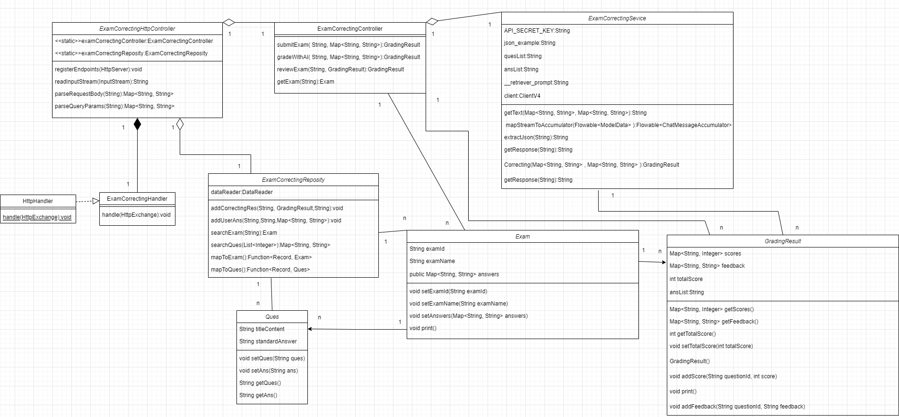
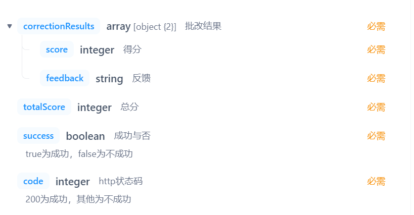
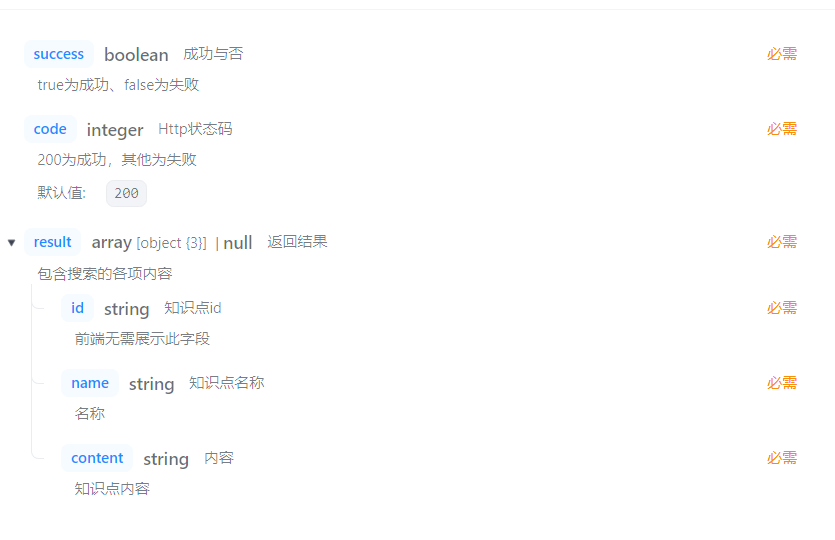

<h1 style="font-size: 48px;">软工导论学习平台开发 ——一次成功的软件工程实践</h1>

<h2 style="font-size: 40px;">过程分析</h2>

<h3 style="font-size: 32px;">一、过程模型</h3>

我们的项目选用敏捷开发方法，在 Scrum 框架的基础上进行改进，具体来说有以下几点：

<h3 style="font-size: 28px;">1. 迭代周期（Sprint）管理</h3>

我们的项目设定了明确的 Sprint 周期，根据功能难度不同和团队的可用时间划分为 1-4 周。  
项目从第 7 周开始进行：
- 7-8 周：确定技术栈，根据要做的功能确定前端页面原型和后端 API 接口，并搭建前后端的大致框架。
- 8-10 周：完成基本功能。
- 10-12 周：在基本功能上细化，完成附加功能。

<h3 style="font-size: 28px;">2. 需求管理与用户故事</h3>

- 我们所有人首先在一起沟通需求，由于自然语言的不精确性，我们会用简单的原型软件先画出前端页面的布局、跳转逻辑等，然后定好后端接口的规范（JSON）。通过这个方法，我们进行了合理的需求管理。
- 在优先级排序上：我们根据功能价值和必要程度对需求进行排序，分为基础部分和细化/提升部分。

<h3 style="font-size: 28px;">3. 任务分解与细化</h3>

- 我们将需求（用户故事）分解为具体的页面，每个页面包含前端要做的组件和逻辑以及后端要实现的接口，确保每个任务都可执行和可测量，但是更细的粒度上不去约束成员，可实现即可。
- 团队协作上，根据团队成员的技能和负载情况合理分配任务，促进协作和知识共享，并且用简便的方法管理任务（后面会细讲）。

<h3 style="font-size: 28px;">4. 日常站会</h3>

- 我们每周会开 3 次会，分别在周二、周四、周末，除了第一次会议在四十分钟左右，其他都在 10-20 分钟之间，确保会议简洁高效。
- 每次会议每个成员回答三个问题：
  1. 上个周期完成了什么？
  2. 这个周期计划做什么？
  3. 遇到了哪些障碍？
- 组长会记录并跟踪会议中提到的问题，及时解决阻碍进展的障碍。

<h3 style="font-size: 28px;">5. 持续集成/持续交付/项目管理</h3>

- 我们前端采用 Git 作为项目版本管理工具，所有代码上传到 GitHub 的私有仓库中，所有成员可及时看到。数据库放在服务器上，交由专门的同学进行维护。更改、合并等活动由组长来监控。
- 前端采用 npm 作为包管理器，后端用 Maven 进行管理，在不同环境下能同样运行，确保了开发、测试和生产环境的一致性。
- 测试上，我们的单元测试采用 JUnit，前后端模块测试采用 Apifox（即前端的每个页面和后端的每个接口）。
- 我们维护详细的 CI/CD 流程文档，向不熟悉项目流程的团队成员讲解这些技术，确保每个人都理解和遵循 CI/CD 实践。

<h3 style="font-size: 28px;">6. 测试驱动开发（TDD）与行为驱动开发（BDD）</h3>

- 后端测试使用 Apifox，测试后端返回接口与 Apifox 中的接口约定，前端页面利用 Apifox 的 mock 功能或者直接利用后端接口测试，可直观检查是否符合功能需求。
- 单元测试采用 JUnit 或打印日志等方法。

<h3 style="font-size: 28px;">7. 迭代评审与回顾</h3>

在完成基本功能后，我们评审了已经完成的功能，并且在此基础上讨论需要做哪些细化和扩展。  
我们讨论后完成了以下功能：
- 选择题与判断题支持
- 知识点修改
- 多用户登录


<h2 style="font-size: 32px;">二、需求分析</h2>

<h3 style="font-size: 28px;">1. 系统概述</h3>
本系统是一个基于知识图谱的软件项目管理学习系统，旨在帮助学生和教师高效学习、管理与评估软件项目管理知识点。通过系统化的知识点关联和大模型辅助功能，实现个性化学习与高效教学。


<h3 style="font-size: 28px;">2. 目标用户</h3>

<h4 style="font-size: 24px;">2.1 学生</h4>
- 查阅、学习知识点及关联内容。
- 通过练习、试卷自我评估学习效果。
- 提问知识点相关问题，获取智能解答。

<h4 style="font-size: 24px;">2.2 教师</h4>
- 管理知识点与习题内容。
- 生成并发布试卷。
- 对试卷进行人工复核与批改，提升批改准确性。

<h3 style="font-size: 28px;">3. 功能性需求</h3>

<h4 style="font-size: 24px;">3.1 用户角色及权限</h4>

<h5 style="font-size: 24px;">学生</h5>
- 登录系统后，使用以下功能：
  - 查阅知识点
  - 提问（大模型问答）
  - 生成试卷
  - 提交答案
  - 查看试卷历史记录

<h5 style="font-size: 24px;">教师</h5>
- 登录系统后，使用以下功能：
  - 管理知识点
  - 生成试卷
  - 批改试卷
  - 复核批改结果

<h4 style="font-size: 28px;">3.2 知识点模块</h4>

<h5 style="font-size: 24px;">功能描述</h5>
- **知识点搜索与展示**：用户通过关键词查找知识点并查看详细内容及关联信息。
- **知识点关联**：知识点之间存在关联关系，如前置知识点、后置知识点及关联知识点。

<h5 style="font-size: 24px;">需求功能</h5>
1. 用户输入关键词，系统展示匹配的知识点列表。
2. 点击知识点，查看详细内容，包括：
   - 知识点名称、标签（难点/重点等）。
   - 认知维度（记忆、理解等）。
   - 详细内容。
   - 前置知识点、后置知识点及关联知识点。
3. 教师可添加、修改或删除知识点内容。

<h4 style="font-size: 28px;">3.3 试卷模块</h4>

<h5 style="font-size: 24px;">功能描述</h5>
试卷模块允许用户基于选定知识点生成试卷，并完成练习与批改。系统支持自动批改和历史记录查看。

<h5 style="font-size: 24px;">需求功能</h5>
1. **试卷生成**：
   - 学生和教师均可根据所选知识点生成试卷。
   - 系统根据所选知识点自动提取关联的习题生成试卷。
   - 试卷生成后提供预览功能。

2. **试卷答题**：
   - 学生完成生成的试卷，并提交答案。
   - 提交后系统利用大模型自动批改，并给出反馈与分数。

3. **试卷批改**：
   - 系统对学生提交的试卷答案进行自动批改。
   - 教师可对自动批改的结果进行人工复核和调整。

4. **试卷历史记录查看**：
   - 学生可查看自己提交的试卷、分数及批改反馈。
   - 教师可查看所有学生的试卷记录，包括提交时间、批改结果和复核情况。

<h4 style="font-size: 28px;">3.4 大模型问答模块</h4>

<h5 style="font-size: 24px;">功能描述</h5>
大模型问答模块为用户提供基于知识点的问答功能，帮助用户快速解决疑问。

<h5 style="font-size: 24px;">需求功能</h5>
1. 用户输入问题，系统将问题提交给大模型处理。
2. 系统根据知识点内容返回答案。
3. 系统记录用户提问历史，用户可随时查看。

<h3 style="font-size: 28px;">4. 非功能性需求</h3>

<h4 style="font-size: 24px;">4.1 性能需求</h4>
- 知识点搜索应在 **1秒** 内返回结果。
- 自动批改的响应时间应控制在 **10秒** 内。

<h4 style="font-size: 24px;">4.2 安全性需求</h4>
- 用户数据（包括登录信息、试卷答案和历史记录）需加密存储。
- 防止非法用户访问敏感数据，支持权限验证。

<h4 style="font-size: 24px;">4.3 可用性需求</h4>
- 界面简洁、易于操作，适合学生和教师。

<h3 style="font-size: 28px;">5. 界面需求</h3>

<h4 style="font-size: 24px;">5.1 知识点页面</h4>
- 包括搜索框、知识点列表及知识点详情页面。

<h4 style="font-size: 24px;">5.2 试卷页面</h4>
- **生成试卷页面**：知识点选择及预览。
- **答题页面**：展示试卷内容及提交功能。
- **批改页面**：显示答案及批改反馈。

<h4 style="font-size: 24px;">5.3 问答页面</h4>
- 提问输入框、提问按钮、回答展示区及历史记录查看。


<h2 style="font-size: 32px;">三、软件建模与软件设计</h2>

- 我们在建模上采用了 UML 方法，取得了较好的成效。
- **页面设计工具**：在前期采用 Axure 和墨刀等软件先画出简单的页面原型，使小组中其他人能直观看到并且进行评价，提出意见。
- **接口设计工具**：使用 Apifox 进行接口约定，所有人都处于团队项目中，可以对接口的设计进行讨论。

<h3 style="font-size: 30px;">用例图</h3>

在我们的应用中，功能间并没有太多的依赖关系，所以主要用用例图描述：


<h3 style="font-size: 30px;">后端模块包图</h3>

以下包图可描述我们后端各个包之间的关系：


<h3 style="font-size: 30px;">后端模块的建模与设计</h3>

我们后端实现的每个接口都保持了大致相同的结构，每个接口都含有对应的 `controller`、`model`、`service`、`repository` 类，并且依赖于 `util` 包中的工具类。**下面仅介绍较为核心的模块**

<h4 style="font-size: 28px;">试卷生成及用户作答模块</h4>

<h5 style="font-size: 24px;">1. generateExam 方法</h5>

`generateExam` 方法的核心功能是根据传入的知识点 ID 列表，自动生成一份试卷，并将试卷信息存储在 Neo4j 数据库中。

- **功能描述**：根据传入的知识点 ID 列表，生成试卷标题，并从数据库中为每个知识点选取最多 5 道题目。生成的试卷包含题目内容、标准答案、题目类型等信息，最终保存到数据库，并返回生成的试卷信息。
- **参数**：
  - `JSONArray knowledgeIds`: 包含多个知识点 ID 的数组。
  - `String username`: 当前用户的用户名。
- **返回值**：
  - `JSONObject`: 返回包含试卷 ID、标题、题目列表及题目 ID 列表的 JSON 对象。
- **实现过程**：
  1. **生成试卷标题**：根据传入的知识点名称构建试卷标题。
  2. **从数据库获取题目**：使用 `ExerciseRepository` 获取每个知识点下的题目列表。
  3. **去重并生成试卷**：避免重复题目，通过集合 `usedQuestionIds` 确保每个题目只添加一次。
  4. **存储试卷数据**：将生成的试卷信息存储到 Neo4j 数据库。

<h5 style="font-size: 24px;">2. saveExam 方法</h5>

`saveExam` 方法用于保存已生成的试卷，标记试卷为已保存状态。方法会更新试卷节点的 `flag` 属性，表明试卷已完成保存。

- **功能描述**：通过试卷 ID 找到对应的试卷并将其标记为已保存，同时清理数据库中未保存的试卷。
- **参数**：
  - `String examId`: 试卷的唯一标识符。
- **返回值**：
  - `JSONObject`: 返回保存结果，包含试卷 ID 和标题。

<h5 style="font-size: 24px;">3. getExam 方法</h5>

`getExam` 方法用于根据试卷 ID 和用户名查询试卷信息。该方法支持根据试卷 ID 查询特定试卷信息，也支持查询某个用户的所有试卷。

- **功能描述**：根据试卷 ID 或用户名查询对应的试卷信息，包括题目列表和试卷 ID。
- **参数**：
  - `String examId`: 试卷 ID，若为空则查询所有试卷。
  - `String username`: 用户名。
- **返回值**：
  - `JSONArray`: 返回试卷列表，包括试卷 ID、标题和题目列表等信息。

<h5 style="font-size: 24px;">4. submitExam 方法</h5>

`submitExam` 方法用于处理学生提交的试卷答案，并将用户答案与试卷进行关联。

- **功能描述**：将学生的作答数据保存到数据库中，并将其与试卷节点关联。
- **参数**：
  - `String examId`: 试卷 ID。
  - `JSONArray answers`: 学生提交的答案列表。
  - `String username`: 用户名。
- **返回值**：
  - `boolean`: 返回是否提交成功。
<h5 style="font-size: 24px;">接口设计</h5>

### 1. **GET /api/knowledge/exercises**

#### 请求参数：

```typescript
export interface Request {
    /**
     * 知识点 ID 编号（可选）
     */
    id?: string;
    [property: string]: any;
}
```

#### 返回响应：

```typescript
export interface Response {
    /**
     * http状态码，200为成功，其他为不成功
     */
    code: number;

    /**
     * 题目列表
     */
    quesList: QuesList[];

    /**
     * 成功与否，状态
     */
    success: boolean;

    [property: string]: any;
}

export interface QuesList {
    /**
     * 标准答案
     */
    standardAnswer: string;

    /**
     * 题目内容
     */
    titleContent: string;

    [property: string]: any;
}
```

#### 功能描述：

- 获取知识点相关的题目列表。可以通过 `id` 参数筛选特定知识点的题目。

------

### 2. **POST /api/exam/generate**

#### 请求参数：

```typescript
export interface Request {
    /**
     * 要包含的知识点ID列表
     */
    knowledgeIds: string[];

    /**
     * 用户名
     */
    username: string;

    [property: string]: any;
}
```

#### 返回响应：

```typescript
export interface Response {
    /**
     * http状态码，200为成功，其他为不成功
     */
    code: string;

    /**
     * 试卷ID
     */
    examId: string;

    /**
     * 试卷标题
     */
    examTitle: string;

    /**
     * 题目列表
     */
    quesList: QuesList[];

    /**
     * 成功与否，true为成功，false为不成功
     */
    success: string;

    [property: string]: any;
}

export interface QuesList {
    /**
     * 标准答案
     */
    standardAnswer: string;

    /**
     * 题目内容
     */
    titleContent: string;

    [property: string]: any;
}
```

#### 功能描述：

- 用户通过传递知识点 ID 列表生成包含相关习题的试卷。

------

### 3. **GET /api/exam/save**

#### 请求参数：

```typescript
export interface Request {
    /**
     * 试卷ID（可选）
     */
    id?: string;

    [property: string]: any;
}
```

#### 返回响应：

```typescript
export interface Response {
    /**
     * http状态码，200为成功，其他为不成功
     */
    code: string;

    /**
     * 试卷ID
     */
    examId: string;

    /**
     * 试卷标题
     */
    examTitle: string;

    /**
     * 题目列表
     */
    quesList: QuesList[];

    /**
     * 成功与否，true为成功，false为不成功
     */
    success: string;

    [property: string]: any;
}

export interface QuesList {
    /**
     * 标准答案
     */
    standardAnswer: string;

    /**
     * 题目内容
     */
    titleContent: string;

    [property: string]: any;
}
```

#### 功能描述：

- 保存试卷数据，完成试卷保存后的状态标记。

------

### 4. **POST /api/exam/submit**

#### 请求参数：

```typescript
export interface Request {
    /**
     * 用户答案列表
     */
    answers: string[];

    /**
     * 试卷ID
     */
    examId: string;

    /**
     * 用户名
     */
    username: string;
}
```

#### 返回响应：

```typescript
export interface Response {
    /**
     * http状态码，200为成功，其他为不成功
     */
    code: number;

    [property: string]: any;
}
```

#### 功能描述：

- 提交用户的试卷答案，并关联到试卷数据。

------

### 5. **GET /api/exam/getExam**

#### 请求参数：

```typescript
export interface Request {
    /**
     * 试卷ID（可选）
     */
    examId?: string;

    /**
     * 用户名（可选）
     */
    username?: string;

    [property: string]: any;
}
```

#### 返回响应：

```typescript
export interface Response {
    /**
     * http状态码，200为成功，其他为不成功
     */
    code: string;

    /**
     * 试卷ID
     */
    examId: string;

    /**
     * 试卷标题
     */
    examTitle: string;

    /**
     * 题目id列表
     */
    quesIds: string[];

    /**
     * 题目详细列表
     */
    quesList: QuesList[];

    /**
     * 成功与否，true为成功，false为不成功
     */
    success: string;

    [property: string]: any;
}

export interface QuesList {
    /**
     * 标准答案
     */
    standardAnswer: string;

    /**
     * 题目内容
     */
    titleContent: string;

    /**
     * 题目类型
     */
    type: string;

    [property: string]: any;
}
```

#### 功能描述：

- 获取试卷内容，包括试卷的标题、题目列表和题目 ID 列表。

------

### 6. **GET /api/exam/getAnswer**

#### 请求参数：

```typescript
export interface Request {
    /**
     * 试卷ID（可选）
     */
    examId?: string;

    /**
     * 用户名（可选）
     */
    username?: string;

    [property: string]: any;
}
```

#### 返回响应：

```typescript
export interface Response {
    /**
     * http状态码，200为成功，其他为不成功
     */
    code: number;

    /**
     * 用户作答数据
     */
    userAnswers: UserAnswer[];

    [property: string]: any;
}

export interface UserAnswer {
    /**
     * 答案列表
     */
    answers: string[];

    /**
     * 用户作答 ID
     */
    id: string;
}
```

#### 功能描述：

- 获取用户作答数据，返回用户的作答答案。

------

### 7. **DELETE /api/exam/del**

#### 请求参数：

```typescript
export interface Request {
    /**
     * 试卷ID
     */
    examId: string;

    [property: string]: any;
}
```

#### 返回响应：

```typescript
export interface Response {
    /**
     * http状态码，200为成功，其他为不成功
     */
    code: string;

    [property: string]: any;
}
```

<h4 style="font-size: 28px;">试卷批改模块</h4>

**试卷批改类图**：



**实现细节**：
- **试卷提交批改后端实现**：
  该模块负责处理学生提交的试卷答案，并进行批改。学生通过前端提交答案，后端接收并存储答案，同时调用大模型接口进行批改。批改结果包含每道题的得分和反馈，并会存储在数据库中。在此过程中，`submitExam` 方法负责接收答案，并调用 `gradeWithAI` 方法与大模型交互。

- **大模型批改试卷后端实现**：
  此模块的核心是与大模型进行交互，利用其强大的智能批改功能。通过调用大模型的批改接口，后端将学生提交的答案与标准答案进行比对，返回批改结果。这一过程不仅生成每道题的得分，还包括针对错误的详细反馈。

- **试卷复核功能后端实现**：
  教师可以对已批改的试卷进行复核，修改批改结果或提供额外的反馈。复核功能通过 `/api/exam/{userAnsId}/review` 接口实现，允许教师在后台进行修改。

<h4 style="font-size: 24px;">数据设计</h4>

1. **Exam 类设计**：
   - 表示一份试卷，包含试卷的基本信息以及该试卷的所有题目和答案。
   - **数据字段**：
     - `examId`：试卷的唯一标识符。
     - `examName`：试卷名称。
     - `answers`：存储题目与标准答案的映射关系，使用 `Map<String, String>` 类型。
   - **核心方法**：
     - `setExamId(String examId)`：设置试卷的 ID。
     - `setExamName(String examName)`：设置试卷名称。
     - `getExample()`：生成试卷示例。
     - `print()`：打印试卷信息，包括题目和答案。

2. **GradingResult 类设计**：
   - 用于存储批改结果，包括得分和反馈。
   - **数据字段**：
     - `scores`：存储每道题目得分的映射。
     - `feedback`：存储每道题目的批改反馈。
     - `totalScore`：总得分。
   - **核心方法**：
     - `addScore(String questionId, int score)`：为指定题目添加得分。
     - `addFeedback(String questionId, String feedback)`：为指定题目添加反馈。

3. **Ques 类设计**：
   - 表示一个单独的题目，包含题目内容和标准答案。
   - **数据字段**：
     - `titleContent`：题目内容。
     - `standardAnswer`：标准答案。
   - **核心方法**：
     - `setQues(String ques)`：设置题目内容。
     - `setAns(String ans)`：设置标准答案。

<h5 style="font-size: 24px;">接口设计</h5>

1. **试卷提交批改接口**：
   - **请求方法**：POST  
   - **请求路径**：`/api/exam/{examId}/submit`  
   - **功能描述**：提交学生的试卷答案，系统批改后返回得分和反馈。

   **请求参数**：
   

   **响应参数**：
   

2. **大模型批改试卷接口**：
   - **请求方法**：POST  
   - **请求路径**：`/api/exam/{examId}/grade`  
   - **功能描述**：通过大模型对试卷进行批改，返回得分和智能反馈。

   **请求参数**：
   

   **响应参数**：
   

3. **试卷复核接口**：
   - **请求方法**：GET  
   - **请求路径**：`/api/exam/{userAnsId}/review`  
   - **功能描述**：教师对试卷进行复核，修改批改结果并提供反馈。

   **请求参数**：
   

   **响应参数**：
   


#### 功能描述：

- 删除指定 ID 的试卷，删除操作会移除相关节点及其关系。

<h4 style="font-size: 28px;">知识点查询与搜索模块</h4>

<h5 style="font-size: 24px;">描述</h5>

用户可以通过模糊搜索的方式查找知识点，并查看与之相关的详细内容、关联知识点、前置和后置知识点等信息。
<h5 style="font-size: 24px;">接口设计</h5>

- 1. 知识点搜索接口
  - **请求方法**：GET  
  - **请求路径**：`/api/knowledge/search`  
  - **功能描述**：输入知识点关键词返回相应内容，支持模糊搜索。
  
- 2. 知识点详情接口
  - **请求方法**：GET  
  - **请求路径**：`/api/knowledge/search?keyword=`  
  - **功能描述**：展示某个知识点的详细内容
  

<h3 style="font-size: 30px;">前端用户友好页面的设计</h3>

<h3 style="font-size: 30px;">数据库设计</h3>


#### 4.用到的设计原则
#### 5. 
#### 6.用到的设计模式

<h3 style="font-size: 32px;">四、质量保证</h3>

### 试卷生成与用户作答
#### 测试策略：

为了确保试卷生成与用户作答模块的可靠性、稳定性以及用户满意度，我们实施了全面的多层次测试策略。此策略涵盖了单元测试、模块测试、前后端联调测试、系统测试及交付测试，确保每个模块和功能在实际环境中能够顺利运行。以下是基于试卷生成与用户作答功能的具体测试内容和执行策略：

------

##### 1. **单元测试（基础逻辑、函数等）**

单元测试是对系统中最小功能单元（如函数和方法）进行的独立测试，确保每个功能的基本逻辑正确性。我们通过单元测试验证核心数据处理类的功能，并确保在单一功能模块下没有潜在的逻辑错误。

**测试内容：**

- **ExamService** 类：
  - 测试 `generateExam` 方法，确保根据知识点生成的试卷包含正确的题目和知识点。
  - 测试 `saveExam` 方法，确保保存试卷时，试卷的题目和相关数据能够正确更新，并且在数据库中标记为已保存。
- **提交与作答相关方法**：
  - 测试 `submitExam` 方法，确保提交的答案能够正确关联到用户，并且能够正确存储到数据库中。
  - 测试 `getAnswersByExamId` 方法，确保用户提交的答案能够通过试卷 ID 和用户名进行准确查询。
  - 测试 `deleteExam` 方法，确保删除试卷操作能够在数据库中成功执行。
- **数据模型测试**：
  - 确保 `Exam` 类、`UserAnswer` 类和其他数据结构能够正确地映射到数据库中的记录，并能够正确处理存储和查询。

**示例测试：**

- 测试 `generateExam` 方法是否能根据传入的知识点 ID 正确生成试卷，并包含指定数量的题目。
- 测试 `submitExam` 方法是否能成功将用户提交的答案存储并与试卷关联。

------

##### 2. **模块测试（每个接口、页面）**

模块测试验证每个独立模块和功能是否能够按照预期工作，确保不同部分的业务逻辑实现无误。通过模拟用户请求，测试试卷生成、用户作答提交和试卷查询等接口的功能。

**测试内容：**

- **试卷生成接口**：
  - 测试 `POST /api/exam/generate` 接口，确保传入知识点 ID 列表后，生成的试卷包含正确的题目，并且返回的试卷 ID 和标题符合预期。
- **试卷保存接口**：
  - 测试 `GET /api/exam/save` 接口，确保保存试卷后，数据库中保存的试卷状态正确更新。
- **用户作答提交接口**：
  - 测试 `POST /api/exam/submit` 接口，确保用户提交的答案能够正确与试卷进行关联，并且答案能够正确存储。
- **试卷内容获取接口**：
  - 测试 `GET /api/exam/getExam` 接口，确保通过传入的试卷 ID 和用户名能够获取到正确的试卷内容和题目列表。

**示例测试：**

- 测试 `generateExam` 方法生成试卷后，调用 `saveExam` 接口是否能够成功保存该试卷。
- 测试 `submitExam` 接口是否能够正确保存用户的作答并返回状态。

------

##### 3. **前后端联调测试（每个页面和对应的接口）**

前后端联调测试确保前端页面能够正确调用后端接口，并且数据交互顺畅，UI呈现的数据准确无误。确保用户从试卷生成、作答提交到查看试卷结果的整个过程能够顺利执行。

**测试内容：**

- **试卷生成页面**：
  - 模拟用户选择多个知识点并点击“生成试卷”按钮，前端通过调用 `/api/exam/generate` 接口生成试卷。
  - 测试生成后的试卷是否正确展示在页面上，题目是否完整。
- **用户作答提交页面**：
  - 测试学生在提交试卷时，是否能够将用户的答案成功提交到 `/api/exam/submit` 接口，并且返回正确的批改结果。
- **试卷批改结果页面**：
  - 测试学生提交试卷后，批改结果是否正确显示，得分和详细反馈信息是否完整。

**示例测试：**

- 模拟用户选择多个知识点并点击“生成试卷”按钮，前端调用接口生成试卷，检查返回的数据是否在页面上正确展示。
- 模拟学生提交作答，前端调用 `submitExam` 接口，检查后端返回的状态码和批改结果是否准确显示在页面上。

<h2 style="font-size: 40px;">结果分析</h2>

# 功能性质量评估
## 需求满足度：
在项目需求分析阶段，我们确保了所有功能模块的需求都被准确捕捉并得到了实现。通过详细的接口设计和数据结构设计，每个功能模块，如试卷提交、批改、复核等，均得到了充分的验证，确保符合最初的需求规格说明书。特别是对于大模型批改和复核功能，我们进行了反复的验证与测试，以确保每个环节的数据流和功能操作正确。

## 功能正确性：
通过多轮的单元测试和集成测试，我们确保了每个功能模块都能够按预期工作。例如，试卷提交批改接口能够正确接收学生提交的答案并生成批改结果；大模型批改接口能够正确调用外部AI接口并返回准确的批改反馈。在大模型批改中，我们也特别关注了接口的调用和反馈的准确性，避免了信息丢失或数据误差。
## 功能完整性
基本实现了需求文档中的所有功能
# 非功能性质量评估
## 核心模块的可靠性
### 试卷生成模块
- 可靠性保障：
使用 usedQuestionIds 集合，确保每道题只出现一次，减少重复性。
每个试卷的存储操作（如调用 saveExam 方法）保证了试卷生成后的数据一致性。通过 Apifox 对接口的逻辑进行多轮验证，确保从知识点到题目的映射没有偏差。
- 潜在问题：
数据库查询性能可能在知识点和题目数量大幅增长时出现瓶颈。
### 试卷批改模块
- 可靠性保障：
提前对大模型API调用设置超时和重试机制，避免接口调用失败影响整个流程。
批改结果存储在数据库中，与试卷和用户作答进行关联，保证数据不会丢失。
教师复核功能（reviewExam）作为兜底手段，确保即使大模型结果存在偏差，也能通过人工方式校正。
- 潜在问题：
大模型在高并发情况下可能导致响应延迟，影响批改的实时性。
批改结果依赖模型的表现，对于复杂主观题，可能会存在误判。
### 知识点查询模块
- 可靠性保障：
数据库索引支持模糊查询，确保关键词搜索的响应时间在需求内（1秒）。
在前端实现了关键词输入防抖机制，避免重复查询浪费资源。
- 潜在问题：
知识点的前后置关系如果维护不当，可能导致错误的关联结果。

## 核心模块可维护性
### 后端模块的分层设计
-模块分工明确：
controller：处理用户请求，调用业务逻辑。
service：负责具体的业务逻辑实现。
repository：与数据库交互。
model：封装数据结构。
### 接口和数据设计
- 标准化接口： 每个接口的请求参数和返回值都有详细说明。例如，/api/exam/submit 的参数中明确定义了试卷ID和答案格式。这样的设计降低了接口调用的出错率。
- 扩展性强： 在增加试卷复核功能时，我们只需要在现有的试卷批改数据模型上新增一个复核字段，而不需要修改原有的接口和逻辑。
### 知识点图谱模块
模块化设计： 知识点的增删改查功能完全独立，不会影响到试卷模块。这种解耦设计便于后期在知识点模块中增加标签分类或难度级别等新特性。
实际维护体验： 在一次需求变更中，新增了知识点的“前置知识点”关系，仅需对后端的知识点查询逻辑进行小幅修改，其他模块完全无需调整。
## 可用性
### 界面设计
我们的界面设计简洁直观，便于用户使用
- 知识点查询页面：
提供了清晰的搜索框，支持关键词模糊查询。
搜索结果以列表形式呈现，点击即可查看详细信息，包括前后置关系、知识点标签等。
- 试卷生成页面：
用户只需选择知识点并点击“生成试卷”按钮，系统自动完成试卷生成并预览，减少了用户的操作复杂度。
提供实时反馈（如生成进度和错误提示），提高用户信心。
- 试卷答题页面：
题目清晰分组，包含题目类型、题目内容及选项。
- 大模型问答页面: 按照ChatGPT网页版风格设计
## 代码质量

可读性：方法命名清晰，例如，generateExam 一目了然地描述了其生成试卷的功能。注释简洁但重点明确，对于复杂方法（如submitExam），注释详细描述了其主要逻辑。

  在新增“多用户角色支持”时，代码只需扩展权限控制部分，而无需修改其他核心功能模块。
  
# 缺陷分析
#### 缺陷分布：
- 在试卷生成与批改部分， 大部分缺陷集中在大模型批改功能和接口交互部分，尤其是在大规模批改时，部分接口存在响应超时或返回数据不一致的情况。经过多次调试和优化后，相关问题已经得到有效解决。我们还加强了接口的容错机制，避免了因外部API调用问题导致的功能失效。
#### 缺陷趋势：
- 随着开发和测试的深入，缺陷数量呈现出逐步减少的趋势。这表明缺陷管理流程逐渐成熟，团队对系统的理解和控制越来越好。后期的测试周期中，缺陷的修复效率也显著提升。