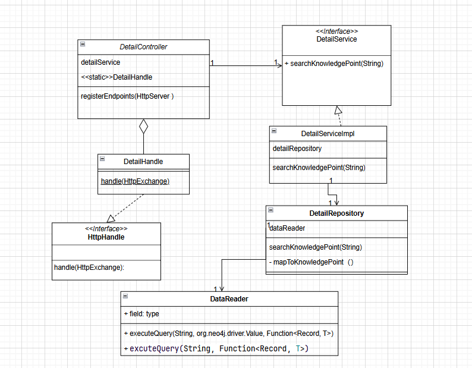

# 软工导论学习平台开发 ——一次成功的软件工程实践

## 过程分析
### 一、过程模型
我们的项目选用敏捷开发方法，在 Scrum 框架的基础上进行改进，具体来说有以下几点
#### 1. 迭代周期（Sprint）管理
我们的项目设定了明确的Sprint周期，根据功能难度不同和团队的可用时间划分为1-4周。项目从第7周开始进行，7-8周确定技术栈，根据要做的功能确定前端页面原型和后端api接口，并搭建前后端的大致框架， 8-10周完成基本功能，10-12周在基本功能上细化，完成附加功能。

#### 2.需求管理与用户故事
- 我们所有人首先在一起沟通需求，由于自然语言的不精确性，我们会在用简单的原型软件先画出前端页面的布局，跳转逻辑等，然后定好后端接口的规范(json)。通过这个方法，我们进行了合理的需求管理。
- 在优先级排序上：我们根据功能价值和必要程度对需求进行排序，分为基础部分和细化/提升部分。
#### 3. 任务分解与细化
- 我们将需求(用户故事)分解为具体的页面，每个页面包含前端要做的组件和逻辑以及后端要实现的接口，确保每个任务都可执行和可测量，但是更细的粒度上不去约束成员，可实现即可。
- 团队协作上，根据团队成员的技能和负载情况合理分配任务，促进协作和知识共享，并且用简便的方法管理任务(后面会细讲)
#### 4. 日常站会
- 我们每周会开3次会左右，分别在周二、周三、周末，除了第一次会议在四十分钟左右，其他都在10-20分钟之间，确保会议简洁高效。
- 每次会议每个成员回答三个问题——上个周期完成了什么、这个周期计划做什么、遇到了哪些障碍。组长会记录并跟踪会议中提到的问题，及时解决阻碍进展的障碍。
#### 5. 持续集成/持续交付/项目管理
- 我们前端采用git作为项目版本管理工具，所有代码上传到GitHub的私有仓库中，所有成员可及时看到。数据库放在服务器上，交由专门的同学进行维护。更改、合并等活动由组长来监控
- 前端采用npm作为包管理器，后端用Maven进行管理，在不同环境下能同样运行，确保了开发、测试和生产环境的一致性
- 测试上，我们的单元测试采用JUnit，前后端模块测试采用apifox(即前端的每个页面和后端的每个接口)
- 我们维护详细的CI/CD流程文档，向不熟悉项目流程的团队成员讲解这些技术，确保每个人都理解和遵循CI/CD实践。
#### 6.测试驱动开发（TDD与行为驱动开发（BDD）
- 后端测试使用apifox，测试后端返回接口与apifox中的接口约定，前端页面利用apifox的mock功能或者直接利用后端接口测试，可直观检查是否符合功能需求
- 单元测试采用JUnit或打印日志等方法
#### 7. 迭代评审与回顾
在完成基本功能后，我们评审了已经完成的功能并且在此基础上讨论需要做哪些细化和扩展，我们讨论后完成了“选择题与判断题支持”、“知识点修改”、“多用户登录”等功能

### 二、软件建模
我们在建模上采用了uml方法，取得了较好的成效
#### 1.用例图

#### 2.类图
我们后端实现的每个接口都保持了大致相同的结构，每个接口都含有对应的controller、model、service、repository类，并且依赖于util包中的工具类。

以查看知识点详情为例

### 三、设计原则与方法
#### 1. 页面设计
- 页面设计工具： 我们在前期采用Axure和墨刀等软件先画出简单的页面原型，使小组中其他人能直观看到并且进行评价，提出意见
- 页面设计方法
#### 2. 接口设计
- 接口设计工具： 使用apifox进行接口约定，所有人都处于团队项目中，可以对接口的设计进行
- 接口设计方法
#### 3.数据库设计

#### 4.用到的设计原则
#### 5. 架构设计
#### 6.用到的设计模式

### 四、质量保证

## 结果分析
### 一、功能性质量评估
#### 1. 需求满足度
#### 2. 功能正确性
#### 3.功能完整性
### 二、非功能性质量评估
#### 1. 可靠性
#### 2. 可维护性
#### 3. 可用性
### 三、结果分析的报告与呈现
### 四、缺陷分析