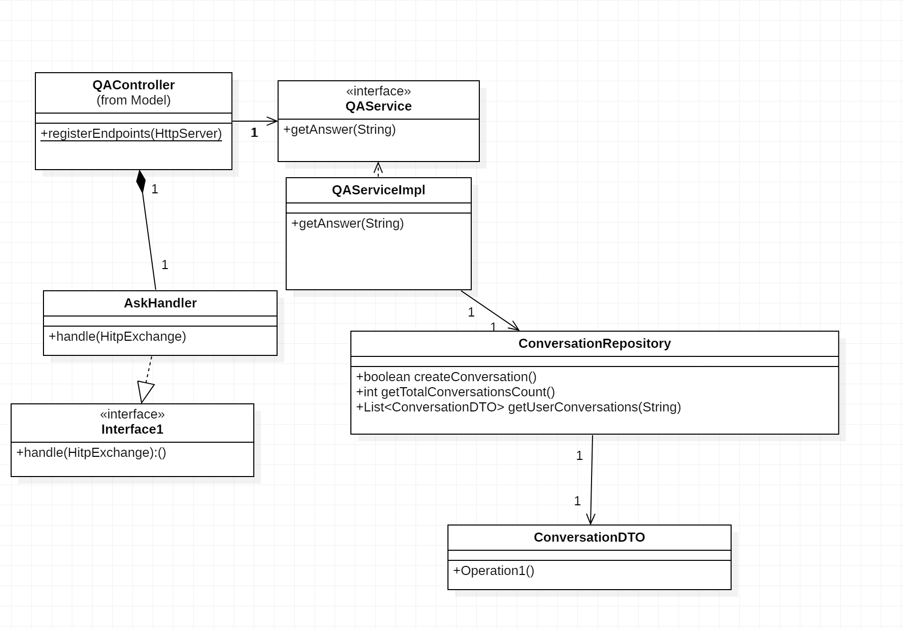
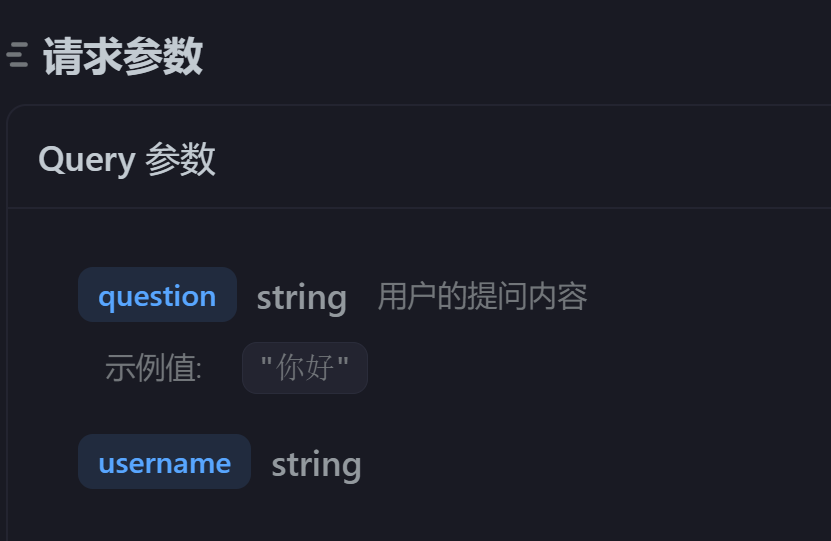
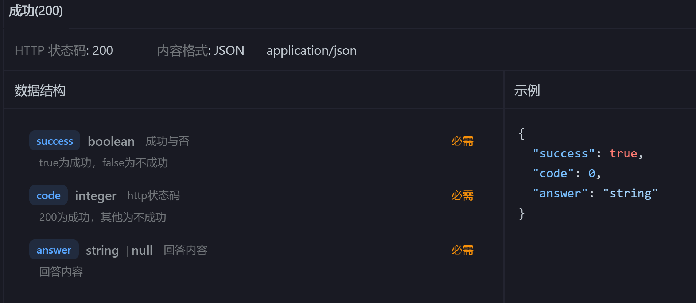
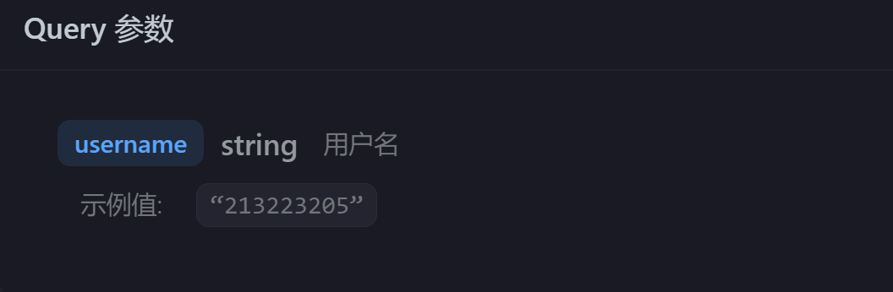
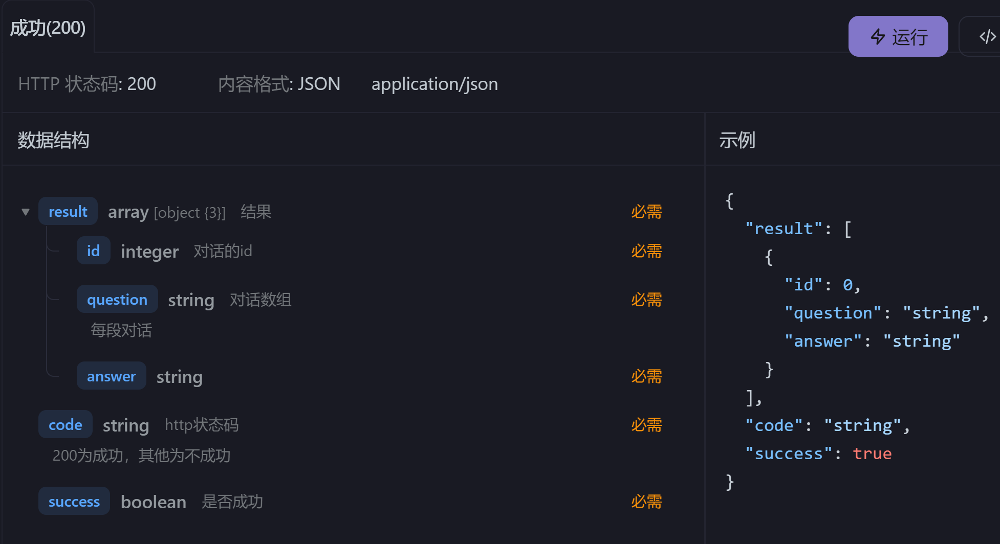

### 模块的建模

#### 问答类图

在整个系统的设计过程中，我们采用面向对象的方法对系统的各个功能模块进行建模，确保系统的高效性、可扩展性和可靠性。主要模块包括：询问问题，查询对话历史。每个模块都通过明确的类与接口进行设计，并通过数据模型确保其功能的清晰划分与可扩展性。以下是每个模块的详细设计和工作流程：

#### 模块设计
1. **问答接口搭建（知识点节点关系生成、试卷批改）**
    - 为了支持问答功能，我们构建了与大模型（如智谱AI）交互的接口。学生提交问题后，系统通过后端调用大模型接口对问题进行回答，返回问题的答案。
    - 此模块的核心功能是通过 RESTful API 与大模型进行交互，处理学生的个性化问题。

2. **用户历史问答接口搭建（知识点节点关系生成、试卷批改）**
    - 在系统中，我们还需要对用户的历史问答进行管理与查询。此模块的设计与大模型接口类似，但更侧重于记录用户的历史互动信息，并能够根据用户的历史数据，生成与知识点的关系图。
    - 用户历史问答接口可以为学生提供基于其历史问题与答案的个性化反馈，进一步优化学习过程。

#### 数据设计

1. **ConversationDTO 类设计**
   `ConversationDTO` 类用于表示一个对话的信息，包含对话的基本属性如对话ID、用户名、问题及答案。此类主要用于后端进行数据传输和管理，提供了获取和设置对话信息的接口。它能有效地帮助系统记录每次用户提问与回答的内容，以便后续处理和反馈。

   - **数据字段**：
     - **conversationId (int)**: 对话的唯一标识符。每个对话都有一个唯一的 `conversationId`，用于区分不同的对话记录。
     - **username (String)**: 参与对话的用户的名称。此字段表示提问或回答的用户。
     - **question (String)**: 用户提出的问题。表示对话中的问题部分。
     - **answer (String)**: 对应问题的答案。表示用户针对问题提供的答案。

   - **核心方法**：
     - **`getConversationId()`**: 获取当前对话的ID。返回对话的唯一标识符 `conversationId`。
     - **`setConversationId(int conversationId)`**: 设置对话的ID。接受一个整数作为参数，并为 `conversationId` 字段赋值。
     - **`getUsername()`**: 获取用户名。返回当前对话的用户名称 `username`。
     - **`setUsername(String username)`**: 设置用户名。接受一个字符串作为参数，并为 `username` 字段赋值。
     - **`getQuestion()`**: 获取问题内容。返回当前对话中提问的内容 `question`。
     - **`setQuestion(String question)`**: 设置问题内容。接受一个字符串作为参数，并为 `question` 字段赋值。
     - **`getAnswer()`**: 获取答案内容。返回当前对话中提供的答案 `answer`。
     - **`setAnswer(String answer)`**: 设置答案内容。接受一个字符串作为参数，并为 `answer` 字段赋值。

#### 系统工作流程
- 问答：
学生提交问题，后端接收并存储。
后端调用大模型接口进行问题回复。
返回答案给学生。

- 历史记录查询：
学生点击查询历史，后端接受用户信息
讲历史对话反馈给学生。

#### 接口设计
- 获取当前问题答案接口：
请求方法：GET
请求路径：/api/qa/ask
功能描述：提交用户的问题，系统返回答案。
接口请求参数

接口响应参数

- 获取历史对话接口：
请求方法：GET
请求路径：/api/qa/history
功能描述：通过传给后端用户的唯一标识，获得用户的历史对话。
接口请求参数

接口响应参数

#### 功能实现

#### 1. **工程框架搭建（数据结构转换与存储）**
该模块的核心任务是将用户的问答数据从非结构化格式（如文本、JSON等）转换为结构化数据，以便系统能够高效存储和处理这些信息。整个流程包括数据转换和存储两个方面：

- **数据转换**：
    - 将用户提交的问题、答案、提问者和回答者的信息等数据从原始的非结构化格式（如文本文件、JSON等）转换为符合数据库模型的结构化数据。这一转换使得数据可以在后续的操作中更加高效地进行检索、分析和处理。
    - 在数据转换过程中，需要对问答内容进行格式化处理，确保数据的规范化与一致性。例如，将问题、答案、用户信息等字段映射到数据库表中的相应列。

- **数据存储**：
    - 使用合适的数据库系统来存储结构化数据，以便快速访问和管理。例如：
        - 使用 **Neo4j** 图数据库来存储用户之间的问答关系。图数据库非常适合存储和查询复杂的关系数据，能够快速识别问题和答案之间的关系，支持图结构的操作。
        - 使用传统的 **MySQL** 或 **PostgreSQL** 等关系型数据库来存储问答记录、用户历史数据等。关系型数据库能够有效地管理大量的结构化数据，并且支持复杂的查询操作。
    - 通过合理设计数据库表结构，确保数据的完整性、一致性和高效访问。同时，使用数据索引和缓存策略来优化查询性能，保证系统在高并发情况下的稳定性和响应速度。

#### 2. **大模型接口搭建（自动问答生成）**
这一模块的目标是实现自动问答生成功能，即当用户提交问题时，系统能够通过与大语言模型（如 GPT 或其他 AI 模型）对接，自动生成并返回问题的答案。大模型接口集成涉及以下功能：

- **大模型集成**：
    - 系统通过调用外部大语言模型的 API 来生成问题的答案。用户输入问题后，后端调用大模型接口，将问题发送给模型进行处理，并返回模型生成的答案。
    - 通过与 GPT、BERT 或其他 AI 模型的对接，实现自动回答问题的功能。大模型能够理解问题的语义，并基于预先训练的知识库和语言能力生成准确的答案。

- **关键接口**：
    - `/api/question/ask`: 用户提交问题，后端调用大模型接口来获取答案。
    - `/api/qa/history`: 用户查询问题的答案，系统返回已经生成的答案或来自大模型的反馈。
    
- **智能反馈**：
    - 除了直接回答问题，系统还可以根据用户提问的方式和历史记录提供反馈。例如：
        - 推荐相关问题：根据用户的提问历史，推荐用户可能感兴趣的相关问题。
        - 提供进一步学习资源：基于问题类型，提供相关的文献、学习材料或视频资源。

#### 3. **历史问答管理（记录与个性化反馈）**
此模块的目标是管理用户的历史问答记录，并根据历史数据为用户提供个性化反馈。

- **问答记录管理**：
    - 系统需要记录用户的每一次提问和回答，便于后续查询与分析。问答记录可以存储在关系型数据库（如 MySQL）中，以便用户能够查看、修改和删除历史记录。
    - 提供接口，允许用户查看自己历史上的提问、回答及其对应的反馈。

- **个性化反馈与推荐**：
    - 根据用户的历史问答记录，为用户提供个性化的学习建议和问题推荐。例如：
        - 如果用户常常提问某一领域的问题，系统可以推荐与该领域相关的其他问题或学习资源。
        - 如果用户的回答频繁出现错误，系统可以为用户提供针对性训练或参考资料，以帮助其改进。

#### 系统架构与组件
- 前后端分离架构：
前端通过Vue框架与用户交互，后端处理逻辑并提供RESTful API。
- Neo4j数据库：
存储对话节点和其属性(对话id、用户id、问题、答案)。
- 问答接口：
系统通过调用大模型实现问答。

